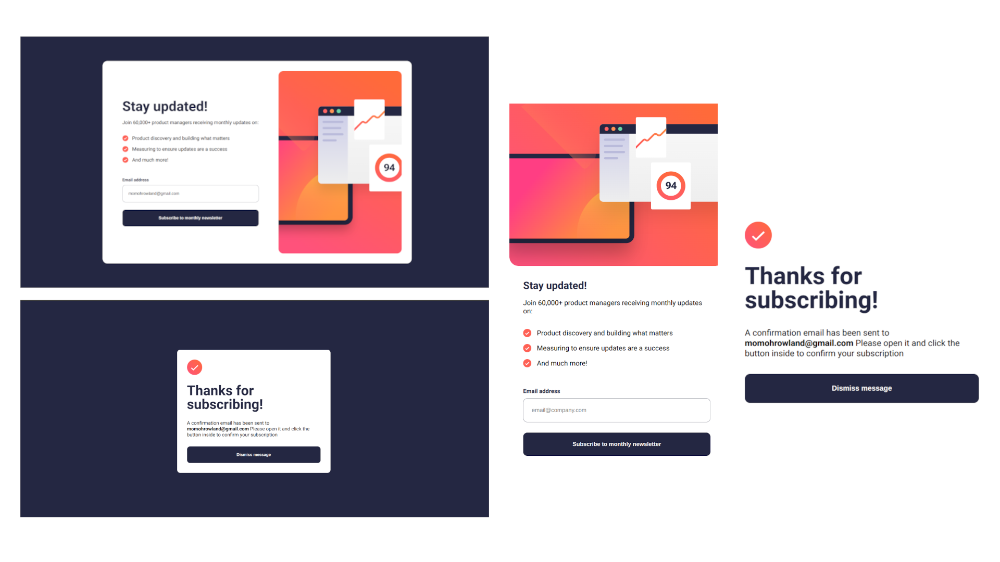

# Frontend Mentor - Newsletter sign-up form with success message solution

This is a solution to the [Newsletter sign-up form with success message challenge on Frontend Mentor](https://www.frontendmentor.io/challenges/newsletter-signup-form-with-success-message-3FC1AZbNrv). Frontend Mentor challenges help you improve your coding skills by building realistic projects.

## Table of contents

- [Overview](#overview)
  - [The challenge](#the-challenge)
  - [Screenshot](#screenshot)
  - [Links](#links)
- [My process](#my-process)
  - [Built with](#built-with)
  - [What I learned](#what-i-learned)
  - [Continued development](#continued-development)
  - [Useful resources](#useful-resources)
- [Author](#author)
- [Acknowledgments](#acknowledgments)

## Overview

### The challenge

Users should be able to:

- Add their email and submit the form
- See a success message with their email after successfully submitting the form
- See form validation messages if:
  - The field is left empty
  - The email address is not formatted correctly
- View the optimal layout for the interface depending on their device's screen size
- See hover and focus states for all interactive elements on the page

### Screenshot



### Links

- Solution URL: [Click here](https://www.frontendmentor.io/solutions/newsletter-sign-up-HdRspxXLgc)
- Live Site URL: [Click here](https://fe-newsletter.netlify.app/)

## My process

### Built with

- Semantic HTML5 markup
- CSS custom properties
- Flexbox
- Mobile-first workflow
- Vanilla JavaScript

### What I learned

I learnt how to implement form validation using vanilla JavaScript. 

I also learnt how to use session storage to transfer data from one html page to another which is what I used to dynamically display email address on the success page                                    

```js
    if (email.includes('@') && email.endsWith('.com'))
        { 
            console.log('valid email') 
            for(const field of fields) { field.value = '' } 
            sessionStorage.setItem('email', email)
            window.location.href = '../success.html'
        }
    else 
        {
            errorLabel.classList.add('show')
            errorInput.classList.add('error')
        }
```

I learnt how to use images to replace bullet points of an li element

```css
ul {
    list-style-type: none;
    margin: 0;
    padding: 0;
}

li {
    background-image: url(../assets/icon-list.svg);
    background-repeat: no-repeat;
    background-position: left top;
    background-size: contain;
    padding: 0rem 2rem;
    margin: 1rem 0;
}
```


### Continued development

I will keep practicing to develop my JavaScript and also learn how to implement form validation with JavaScript libraries


### Useful resources

- [MDN web docs](https://developer.mozilla.org/en-US/docs/Web/API/Window/sessionStorage) - This helped me understand session storage in JavaScript and how to use it
- [Pass JavaScript Variable to Another Page](https://lage.us/Javascript-Pass-Variables-to-Another-Page.html#:~:text=There%20are%20two%20ways%20to,query%20string%20with%20the%20URL.) - This helped me understand how to transfer variable between html pages using JavaScript

## Author

- Website - [Rowland Momoh](https://rowland-momoh.netlify.app/://www.your-site.com)
- Frontend Mentor - [@rowleks](https://www.frontendmentor.io/profile/rowleks)
- Twitter - [@Rolexks](https://x.com/Rolexks)

## Acknowledgments

I'm grateful to frontend mentor for this challenge as it helps build my web development skills further. I also thank google, w3school, MDN web docs and other similar sites for their amazing and helpful resources.
